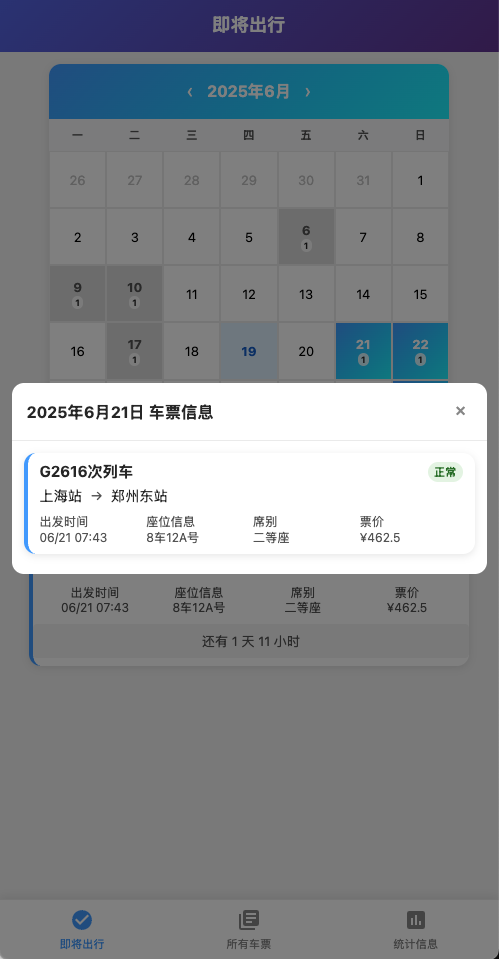

# 12306 车票信息管理系统

一个基于邮箱爬取 12306 车票信息并进行可视化展示的开源项目。

## 🚀 功能特性

- 📧 **邮箱自动爬取**: 自动从邮箱中获取 12306 的购票、退票、候补通知邮件
- 🎫 **车票信息解析**: 智能解析邮件内容，提取车票详细信息
- 📊 **数据可视化**: 提供美观的 Web 界面展示车票信息
- 📅 **日历视图**: 支持日历形式查看车票信息
- 📈 **统计分析**: 提供车票统计信息，包括热门车次、席位分布等
- 🔄 **实时更新**: 支持定时自动更新车票信息
- 📱 **移动端适配**: 完美支持手机端访问

## 🛠️ 技术栈

- **后端**: Python + FastAPI
- **数据库**: SQLite
- **前端**: HTML + CSS + JavaScript
- **邮件处理**: IMAP + BeautifulSoup
- **数据解析**: 正则表达式

## 📦 安装

### 系统要求

- **Python**: 3.7 或更高版本
- **操作系统**: Windows, macOS, Linux

### 1. 克隆项目

```bash
git clone https://github.com/wenyg/12306-ticket-manager.git
cd 12306-ticket-manager
```

### 2. 安装依赖

```bash
# 使用Python 3
python3 -m pip install -r requirements.txt
```

### 3. 配置邮箱

编辑 `config.py` 文件，配置您的邮箱信息：

```python
# 邮箱配置
EMAIL_CONFIG = {
    "imap_host": "imap.163.com",  # 邮箱服务器地址
    "email_user": "your-email@163.com",  # 邮箱账号
    "email_pwd": "your-password",  # 邮箱密码或授权码
    "folder_name": "12306"  # 存放12306邮件的文件夹
}

# 乘客姓名过滤（可选）
PASSENGER_FILTER = "温阳光"  # 只处理指定乘客的车票信息
```

#### 📁 邮箱文件夹设置建议

为了更高效地处理邮件，建议您：

1. **创建专门的12306文件夹**：
   - 在邮箱中创建一个名为"12306"的文件夹
   - 将所有12306相关的邮件移动到此文件夹
   - 这样可以避免处理大量无关邮件，提高系统效率

2. **邮件过滤规则**：
   - 设置邮箱自动过滤规则，将12306邮件自动归类到指定文件夹
   - 支持的邮件主题关键词：
     - `网上购票系统-用户支付通知`
     - `网上购票系统-候补订单兑现成功通知`
     - `网上购票系统-用户退票通知`

#### 📅 邮件拉取范围设置

系统支持设置邮件拉取的时间范围，避免处理过多历史邮件：

```python
# 邮件拉取配置（可选）
MAIL_FETCH_CONFIG = {
    "days_back": 30,  # 只拉取最近30天的邮件，设为None则拉取所有邮件
    "max_emails": 100  # 最多处理100封邮件，设为None则不限制
}
```

**建议设置**：
- **首次使用**: 设置 `days_back: 7` 或 `days_back: 30`，避免处理过多历史邮件
- **日常使用**: 设置 `days_back: 1` 或 `days_back: 3`，只处理最近的邮件
- **数据迁移**: 设置 `days_back: None` 和 `max_emails: None`，处理所有历史邮件

#### ⚠️ 重要提示：邮箱服务器限制

**请注意邮箱服务器本身的限制**：
- **IMAP协议限制**: 大多数邮箱服务商对IMAP连接有邮件数量限制
- **服务器端限制**: 邮箱服务器可能只返回最近几百封或几千封邮件
- **常见限制**：
  - 163邮箱：通常限制最近1000-2000封邮件
  - QQ邮箱：通常限制最近500-1000封邮件
  - Gmail：通常限制最近1000-2000封邮件
  - Outlook：通常限制最近500-1000封邮件

**如果发现拉取不到所有历史邮件**：
1. 这是邮箱服务器的正常限制，不是系统问题
2. 建议分批处理：先处理最近1个月的邮件，再逐步扩大范围
3. 如需完整数据，建议手动导出邮件或联系邮箱服务商

### 4. 初始化数据库

```bash
python3 -c "from ticket.models import TicketDB; db = TicketDB(); db.close()"
```

## 🚀 使用

### 1. 启动服务

```bash
python3 main.py
```

服务将在 `http://localhost:8888` 启动。

### 2. 手动更新车票信息

```bash
curl http://localhost:8888/update_ticket
```

### 3. 访问 Web 界面

打开浏览器访问 `http://localhost:8888/tickets/web` 查看车票信息。

## 📱 界面预览

### 主界面展示


### 车票详情页面


### 统计信息页面


### 即将出行页面
- 显示最近的车票信息
- 倒计时显示距离出发时间
- 日历视图展示车票分布

### 所有车票页面
- 按月份展示所有车票
- 支持点击查看详细信息
- 区分正常、候补、退票状态

### 统计信息页面
- 总车票数和候补比例
- 总金额和平均票价
- 热门车次排行
- 席位类型统计

## 🔧 配置说明

### 邮箱配置

项目支持多种邮箱服务商：

- **163邮箱**: `imap.163.com`
- **QQ邮箱**: `imap.qq.com`
- **Gmail**: `imap.gmail.com`
- **Outlook**: `outlook.office365.com`

### 邮件过滤

系统会自动处理以下类型的邮件：
- `网上购票系统-用户支付通知` - 购票成功通知
- `网上购票系统-候补订单兑现成功通知` - 候补成功通知
- `网上购票系统-用户退票通知` - 退票通知

## 📊 API 接口

### 获取所有车票信息

```http
GET /tickets
```

响应示例：
```json
{
  "total": 10,
  "tickets": [
    {
      "order_id": "E123456789",
      "passenger_name": "温阳光",
      "departure_time": "2024-01-15T08:30:00",
      "departure_station": "北京",
      "arrival_station": "上海",
      "train_number": "G1次列车",
      "carriage_number": "8车",
      "seat_number": "12A号",
      "seat_type": "二等座",
      "price": 553.5,
      "is_waiting": false,
      "is_refunded": false,
      "service_fee": 0.0
    }
  ]
}
```

### 访问Web界面

```http
GET /tickets/web
```

返回美观的HTML页面，展示车票信息。

### 更新车票信息

```http
GET /update_ticket
```

## 🤝 贡献

欢迎提交 Issue 和 Pull Request！

### 开发环境设置

1. Fork 项目
2. 创建功能分支: `git checkout -b feature/AmazingFeature`
3. 提交更改: `git commit -m 'Add some AmazingFeature'`
4. 推送分支: `git push origin feature/AmazingFeature`
5. 提交 Pull Request

## 📄 许可证

本项目采用 MIT 许可证 - 查看 [LICENSE](LICENSE) 文件了解详情。

## ⚠️ 免责声明

本项目仅供学习和研究使用，请遵守相关法律法规和12306的使用条款。使用者需要自行承担使用风险。

## 📞 联系方式

- 项目主页: https://github.com/wenyg/12306-ticket-manager
- 问题反馈: https://github.com/wenyg/12306-ticket-manager/issues

---

如果这个项目对您有帮助，请给个 ⭐️ 支持一下！ 